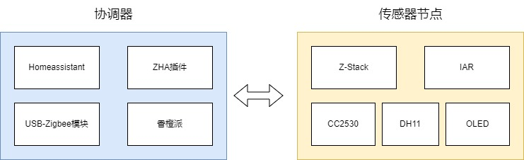
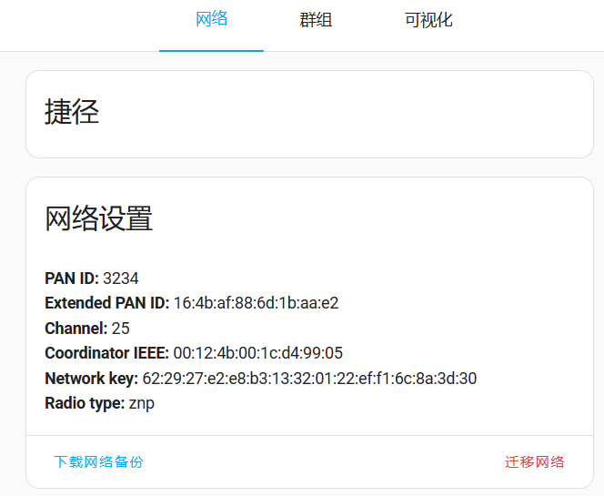
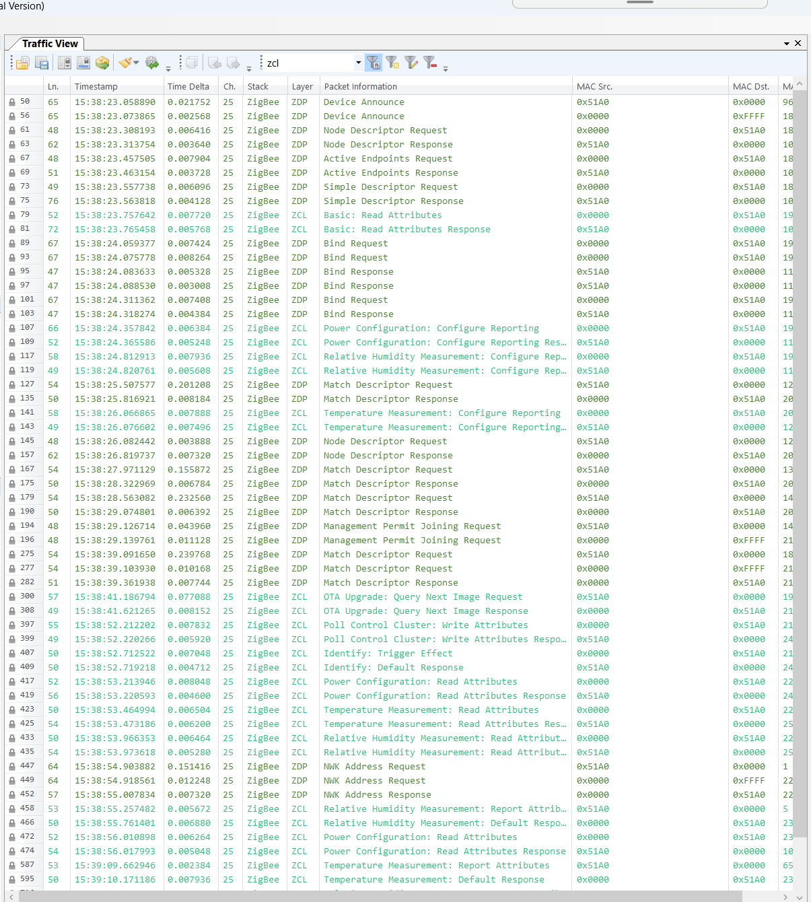
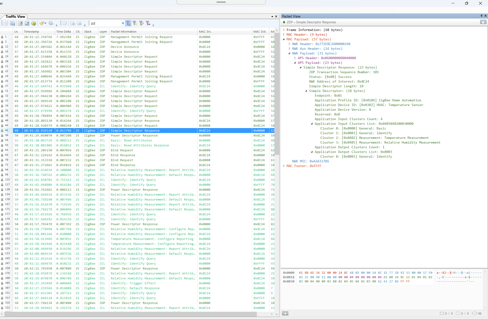
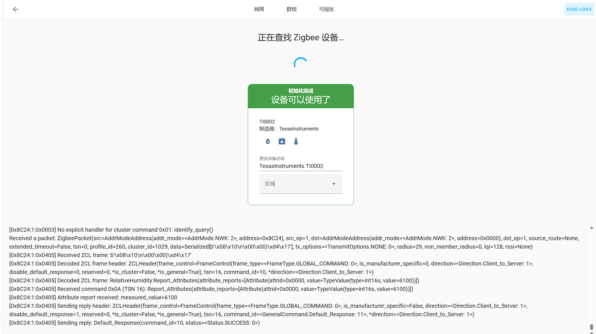
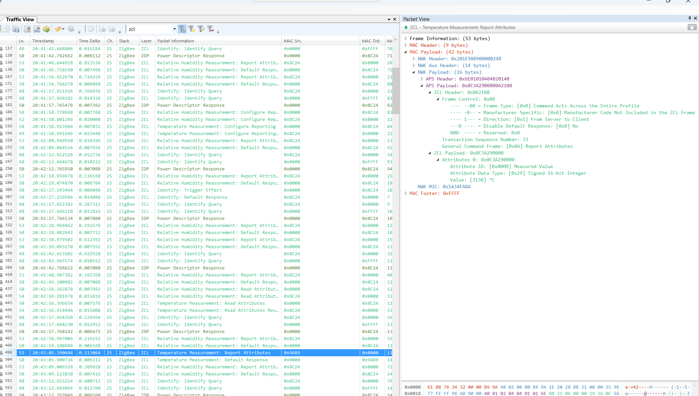
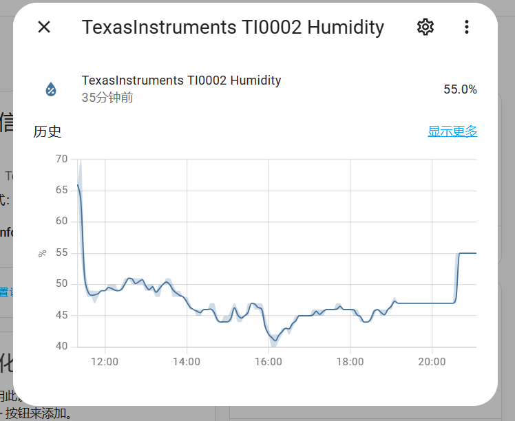

# 使用CC2530开发板制作Zigbee温湿度传感器并接入Home Assistant

## 引言
Zigbee是一种低功耗、短距离无线通信技术，广泛应用于智能家居领域。它为智能设备之间的互联提供了一种可靠、安全且高效的通信解决方案。利用Zigbee，我们可以构建一个灵活可扩展的智能家居系统，实现各种功能，如智能照明、温湿度监测、安全警报等。其低功耗特性还使得Zigbee设备能够长时间运行，减少了能源消耗的压力。

CC2530是一款常用的Zigbee开发板，具有出色的性能和灵活性。它基于TI的SoC（系统级芯片）设计，集成了Zigbee无线通信协议栈和丰富的外设接口。本次实验使用的是善学坊的[Zigbee开发板](https://m.tb.cn/h.5Y9Qd5L?tk=6u6jdGY2rsT)，善学坊的开发板和资料相对较新，例程比较易于学习，质量较高，教程比较详细和全面，录制的较新。

目前网络上关于CC2530的资料很多但是比较烦杂混乱，并且Z-Stack的文档并不详细。因此，记录一下使用Z-Stack和CC2530开发一个温湿度传感器的完整过程，本次实验的系统架构如图所示。



## 准备工作

### 传感器节点准备

1. 安装IAR和Z-Stack
   - 在进行CC2530开发之前，需要安装IAR Embedded Workbench作为开发环境。我们可以从IAR官方网站下载并安装适用于我们的操作系统的版本：[IAR官方网站](https://www.iar.com/iar-embedded-workbench/)
   - 安装完成后，我们还需要获取Z-Stack软件包，该软件包包含了Zigbee通信协议栈的开发工具和示例代码。我们可以从TI（德州仪器）官方网站下载Z-Stack：[TI官方网站](https://www.ti.com/tool/Z-STACK)
2. 获取CC2530开发板、DHT11传感器和OLED屏幕（可选）
   - CC2530开发板：我们可以从善学坊的[Zigbee开发板](https://m.tb.cn/h.5Y9Qd5L?tk=6u6jdGY2rsT)获取与本教程所用硬件相符的开发板。
   - DHT11传感器：DHT11是一款常用的数字温湿度传感器，可测量周围环境的温度和湿度。请确保我们已获得可靠的DHT11传感器。
- OLED屏幕（可选）：OLED显示屏可以用于显示温湿度等传感器数据，提供更直观的信息展示。我们可以在善学坊的[Zigbee开发板](https://m.tb.cn/h.5Y9Qd5L?tk=6u6jdGY2rsT)中获取与开发板相匹配的OLED屏幕。
3. 配置ZStack中的Home Automation的TemperatureSensor例程
   - ZStack中提供了一个名为Home Automation的示例代码，其中包含了SampleTemperatureSensor例程，可作为我们的参考实现。我们可以通过以下链接获取ZStack的文档和示例代码：[ZStack文档和示例代码](https://www.ti.com.cn/tool/download/Z-STACK-GUI)
   - Home Automation的示例代码，其中包含了SampleTemperatureSensor例程，可作为我们的参考实现。您可以通过以下链接获取ZStack的文档和示例代码：[ZStack文档和示例代码](https://www.ti.com.cn/tool/download/Z-STACK-GUI)。善学坊的`TemperatureSensor工程源码分析`对官方的例程进行了适配，包括了开发板引脚的配置以及OLED和DHT11的驱动编写。您可以直接使用这个适配好的例程进行开发，因为CC2530的引脚相关的配置较为繁琐，为了确保成功率，我们推荐使用具备例程的开发板。

### 协调器准备

#### 硬件

在设置协调器的过程中，我们需要准备以下硬件设备：

- 树莓派、香橙派或其他单板计算机：我们可以选择适用于Zigbee协调器的单板计算机，例如树莓派或香橙派。这些单板计算机具有较强的处理能力和扩展性，可用作我们的Zigbee协调器。
- CC2531 Zigbee模块：CC2531是一款USB接口的Zigbee模块，可用作协调器。

准好好香橙派和USB-Zigbee模块后，需要将CC2531 Zigbee模块插入香橙派的USB接口上。使用命令行工具查看系统日志，以找到新连接的USB设备的串口号，以便后续使用。

```bash
dmesg | tail
```

在输出中，找到最近连接的USB设备的信息。通常，您会看到类似于以下内容的行：

```
[12345.67890] usb 1-1.2: New USB device found, idVendor=abcd, idProduct=efgh, serial=0123456789
[12345.67891] usb 1-1.2: Product: Zigbee USB Coordinator
[12345.67892] usb 1-1.2: Manufacturer: XYZ Corporation
[12345.67893] cdc_acm 1-1.2:1.0: ttyACM0: USB ACM device
```

在这个示例中，设备路径为`/dev/ttyACM0`。

记下找到的设备路径，我们稍后在配置Home Assistant的Docker Compose文件时会用到。

#### 安装Docker环境

Docker是一种流行的容器化平台，可帮助我们快速部署和管理应用程序。我们可以按照以下步骤安装Docker环境：

- 根据我们的操作系统，选择合适的Docker版本进行下载和安装：[Docker下载链接](https://example.com/docker-download)
- 按照官方文档中的说明，完成Docker的安装和配置。

首先确保您的树莓派已连接到互联网。

输入以下命令来扫描可用的WiFi网络：

```
sudo iwlist scan
```

输入以下命令来连接WiFi网络：

```
sudo nmcli device wifi connect <SSID> password <password>
```

等待几秒钟，直到网络连接成功。可以通过使用以下命令检查网络连接状态：

```
nmcli device status
```

打开终端并运行以下命令来升级您的系统软件包列表：

```
sudo apt-get update
```

**在香橙派上安装 Docker，可以使用以下命令**：

```bash
curl -sSL https://get.docker.com | sh
```

安装完成后，运行以下命令以将当前用户添加到docker用户组（可选）：

```bash
sudo usermod -aG docker $USER
```

为了使更改生效，注销并重新登录香橙派。

**安装 Docker Compose**：

```bash
sudo apt-get install docker-compose
```

检查 Docker Compose 是否已正确安装：

```
docker-compose --version
```

#### 使用Docker运行Home Assistant

- 创建一个名为`docker-compose.yml`的文件，使用文本编辑器打开，并将以下内容复制粘贴到文件中：

```
version: '3'
services:
  homeassistant:
    container_name: homeassistant
    image: homeassistant/home-assistant:latest
    restart: always
    network_mode: host
    volumes:
      - ./config:/config
      - /etc/localtime:/etc/localtime:ro
      - /dev/ttyACM0:/dev/ttyACM0
    devices:
      - /dev/ttyACM0:/dev/ttyACM0
    environment:
      - TZ=Asia/Shanghai
```

- 将`./config`替换为您要将Home Assistant配置文件保存的路径。

- 将`/dev/ttyACM0`替换为您的USB-Zigbee模块的设备路径，您可以使用以下命令检查设备路径：

```bash
ls /dev/ttyUSB*
```

#### 运行Home Assistant Docker镜像

- 在终端中，导航到包含`docker-compose.yml`文件的目录。

- 运行以下命令以启动Home Assistant容器：

  ```
  docker-compose up -d
  ```

#### 启用ZHA和MQTT插件

局域网下访问`<device-ip>:8123`，在Home Assistant的Web界面中启用ZHA插件。

配置zha集成，指定Zigbee适配器的设备路径后，会发现对应的USB zigbee 适配器。


## 编写固件
### 配置传感器节点固件

下载善学坊的`TemperatureSensor工程源码分析.zip`例程，解压后使用IAR打开`Z-Stack 3.0.1\Projects\zstack\HomeAutomation\SampleTemperatureSensor`。

左边的Worksapce选择`EndDeviceEB`


**信道**：`Projects\zstack\Tools\CC2530DB\f8wConfig.cfg`的文件可以配置传感器终端节点的zigbee参数，其中`DDEFAULT_CHANLIST`信道参数需要和Home assistant的网络设置保持一致。


**端点号**：修改`Projects\zstack\HomeAutomation\SampleTemperatureSensor\Source\zcl_sampletemperaturesensor.h`文件中的`SAMPLETEMPERATURESENSOR_ENDPOINT`宏定义，端点号改为1

### 添加属性

1. 打开`zcl_sampletemperaturesensor_data.c`文件。
2. 在文件中找到名为`zclSampleTemperatureSensor_Attrs[]`的数组，该数组定义了当前已经存在的属性。
3. 在`zclSampleTemperatureSensor_Attrs[]`数组中，添加一个新的属性定义，用于相对湿度。每个属性定义包含以下信息：
   - `clusterID`：属性所属的簇（Cluster）ID。
   - `attrID`：属性的唯一标识符。
   - `dataType`：属性的数据类型。
   - `accessControl`：属性的访问控制权限。
   - `attrData`：属性的数据指针。

```c
CONST zclAttrRec_t zclSampleTemperatureSensor_Attrs[] =
{
  // ...
  {
    ZCL_CLUSTER_ID_MS_TEMPERATURE_MEASUREMENT,
    {  // Attribute record
      ATTRID_CLUSTER_REVISION,
      ZCL_DATATYPE_UINT16,
      ACCESS_CONTROL_READ,
      (void *)&zclSampleTemperatureSensor_clusterRevision_all
    }
  },
  {
    // 相对湿度
    ZCL_CLUSTER_ID_MS_RELATIVE_HUMIDITY,
    { // Attribute record
      ATTRID_MS_RELATIVE_HUMIDITY_MEASURED_VALUE,
      ZCL_DATATYPE_INT16,
      ACCESS_CONTROL_READ | ACCESS_REPORTABLE,
      (void *)&zclSampleTemperatureSensor_Humidity_MeasuredValue
    }
  },
};
```

其他的包括初始化函数、上报函数、消息处理函数等均仿造温度属性来编写即可。

### 编译并烧录传感器节点固件到CC2530开发板

完成传感器节点固件的配置后，我们需要进行编译并将固件烧录到CC2530开发板上。

安装cc-debugger的驱动后，点击Download and Debug，将固件烧录到CC2530开发板中。

首次通过CC-Debugger连接到CC2530时，需要摁下CC-Debugger上的复位键。

## 验证

在HA的UI界面中，通过zigbee协调器添加新设备。

### zigbee工作流程

Zigbee工作流程涉及到传感器节点的加入网络、数据传输和设备管理等方面。

**初始化和网络建立阶段**：

- 在初始化阶段，协调器启动Zigbee网络并广播Pan ID（个人区域网络标识符）。
- 传感器节点会搜索并加入协调器广播的网络。
- 在HA的UI界面中，我们通过协调器添加新设备的过程，触发了初始化和网络建立阶段的操作。
- 报文示例：`Beacon Request`、`Beacon`。

**网络加入阶段**：

- 传感器节点通过发送加入请求报文来请求加入Zigbee网络。
- 协调器接收到加入请求后，对传感器节点进行身份验证并决定是否接受其加入。
- 一旦传感器节点成功加入网络，它就成为网络的一部分，并能与其他设备进行通信。
- 报文示例：`Join Request`、`Join Response`。

**安全认证和密钥协商阶段**：

- 当传感器节点成功加入网络后，进行安全认证和密钥协商。
- 报文示例：`Network Key Request`、`Network Key Response`。

**设备通信阶段**：

- 在设备通信阶段，传感器节点可以与协调器进行双向通信，传输数据和执行命令。
- 报文示例：`Data Request`、`Data Response`。

**路由和数据转发阶段**：

- 当网络中的传感器节点需要与其他节点通信时，数据包会通过路由进行转发，以达到目标节点。
- 报文示例：`Route Request`、`Route Response`。

### ubiqua添加key

打开Ubiqua，添加信任中心的Link Key，抓取后才能解密zigbee报文。

```c
// ZigBee Alliance Pre-configured TC Link Key - 'ZigBeeAlliance09' (for Centralized networks)
#define DEFAULT_TC_LINK_KEY             { 0x5a, 0x69, 0x67, 0x42, 0x65, 0x65, 0x41, 0x6c,\
                                          0x6c, 0x69, 0x61, 0x6e, 0x63, 0x65, 0x30, 0x39 }
```

也可以添加HA的`Network key`，进行解密。



### ubiqua设置过滤器

为了更好地分析节点入网的流程，我们可以在Ubiqua中设置一个过滤器，以便只显示与ZCL和ZDP相关的报文。

Zigbee Cluster Library（ZCL）是一种标准化的协议库，用于定义和管理Zigbee网络中的应用层功能。它提供了一套通用的集群（Cluster）和属性（Attribute）定义，以及与之相关的命令（Command）和数据类型。通过使用ZCL，开发人员可以快速构建具有特定功能的设备和应用。

Zigbee Device Profile（ZDP）是一种用于设备发现、网络管理和协调器功能的协议。ZDP定义了与设备相关的管理和控制功能，例如设备加入网络、路由发现和设备描述等操作。它与ZCL协议紧密配合，共同构建了完整的Zigbee网络和应用生态系统。

在Ubiqua中，我们可以设置过滤器来仅显示与ZCL和ZDP相关的报文。通过这样的过滤器设置，我们可以聚焦于分析节点入网的流程，并更好地理解Zigbee网络中的应用层和设备管理功能。


### ubiqua的zdp和zcl层报文

ubiqua抓取的报文如下。



节点描述符中，传感器节点向协调器提供有关其能力和特性的信息，报文包含了节点的类型、频段支持、MAC层能力等信息。

简单描述符报文是传感器节点向协调器提供其支持的集群和属性的信息。它包含了节点支持的集群和属性的详细描述。在简单描述符响应报文中，我们可以看到Application Input Clusters List（应用层输入集群列表）包含0x0402(温度)和0x0405(相对湿度)的cluster id。初始化过程中会读取`CONST zclAttrRec_t zclSampleTemperatureSensor_Attrs[]`列表，统计其中涉及到的cluster id，然后通过简单描述符发送。



之后协调器会根据获取到的简单描述符中的cluster id列表，向传感器节点发送相应属性的Configure Reporting报文。通过Configure Reporting报文，协调器告知传感器节点在报文中所定义的属性上报数据的频率和格式。

完成上述配置后，协调器就成功添加了传感器节点，HA的界面也显示设备已初始化完成，属性也与节点配置的保持一致。




节点也会不断向协调器上报温度和相对湿度的属性值，报文如下所示。



HA的传感器界面中可以看到所有的历史数据。



## 源代码

[eternal-echo/zigbee-sensor-enddevice at tem_humi (github.com)](https://github.com/eternal-echo/zigbee-sensor-enddevice/tree/tem_humi)